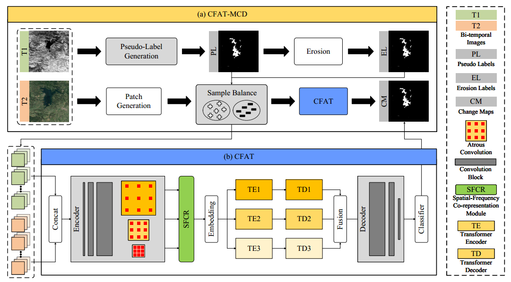

# [Collaborative Frequency-Aware Transformer for Unsupervised Multimodal Change Detection in Heterogeneous Remote Sensing Images](https://github.com/pu7yan9/CFAT_MCD)

<p align="center">
  
</p>

This is a PyTorch/GPU implementation of the paper [Collaborative Frequency-Aware Transformer for Unsupervised Multimodal Change Detection in Heterogeneous Remote Sensing Images](https://ieeexplore.ieee.org/document/11145887):

```
@ARTICLE{pu2025collaborative,
  author={Pu, Yan and Gong, Maoguo and Liu, Tongfei and Zhang, Mingyang and Li, Jianzhao and Zheng, Hanhong and Zhao, Yue},
  journal={IEEE Transactions on Geoscience and Remote Sensing}, 
  title={Collaborative Frequency-Aware Transformer for Unsupervised Multimodal Change Detection in Heterogeneous Remote Sensing Images}, 
  year={2025},
  volume={63},
  number={},
  pages={1-15},
```

## Requirements

 - [ ] python  3.7.16
 - [ ] torch  1.13.1
 - [ ] torchvision  0.14.1
 - [ ] opencv  4.7.0.72
 - [ ] numpy  1.21.5

### Dataset

| Multimodal Dataset   | Download Link                                                                                         |
|----------------------|-------------------------------------------------------------------------------------------------------|
| Sardinia, Italy             | [Download](https://drive.google.com/file/d/1O4lxuFwwoVLYtaY51ZDTqQVes3enOz4c/view?usp=drive_link)     |
| Yellow River, China         | [Download](https://drive.google.com/file/d/1pizeWMB49TUSgYKhVQlfAZKkLLuQ_k_9/view?usp=drive_link)     |
| Shuguang, China             | [Download](https://drive.google.com/file/d/1gSPuQ4uPRKjM-Fk7DDNIcK2j6J0hwrS_/view?usp=drive_link)     |
| Gloucester2, UK              | [Download](https://drive.google.com/file/d/1k20_r5yZvKd6dN8S3ckvabuvPQssHbO1/view?usp=drive_link)     |
| Toulouse, France            | [Download](https://drive.google.com/file/d/1Co0mDUHMOp5dAoWHvo7wnEMv6VBUSHhi/view?usp=drive_link)     |


## Usage

### Train and Test
```python
  python main.py
```
